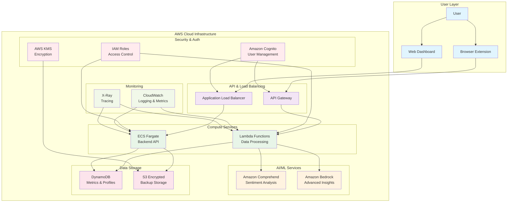
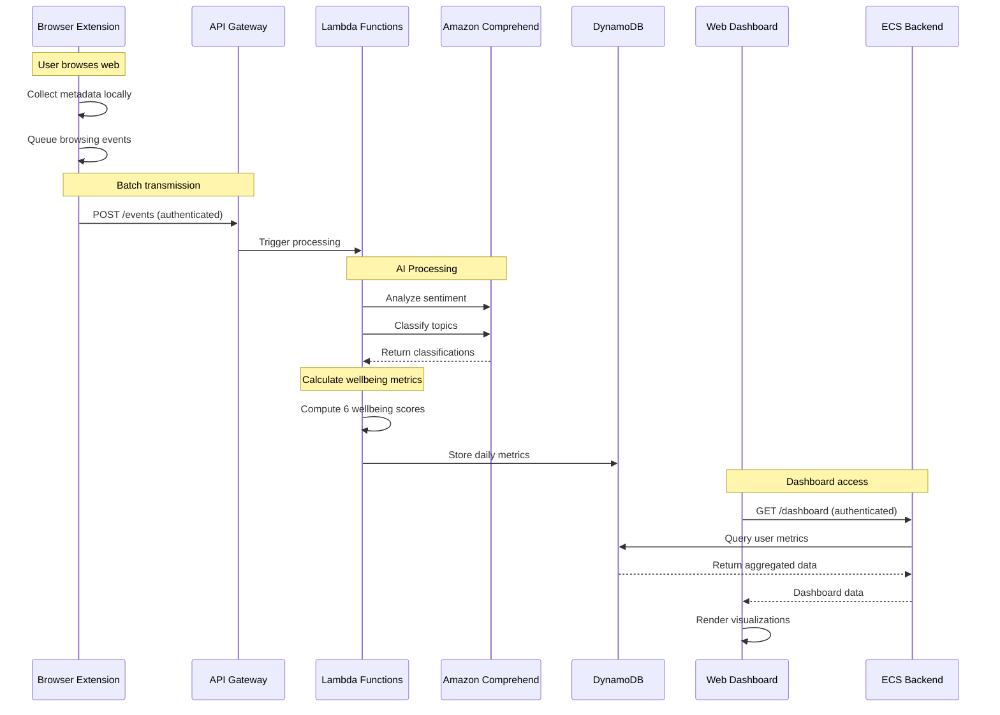
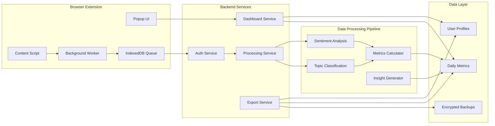
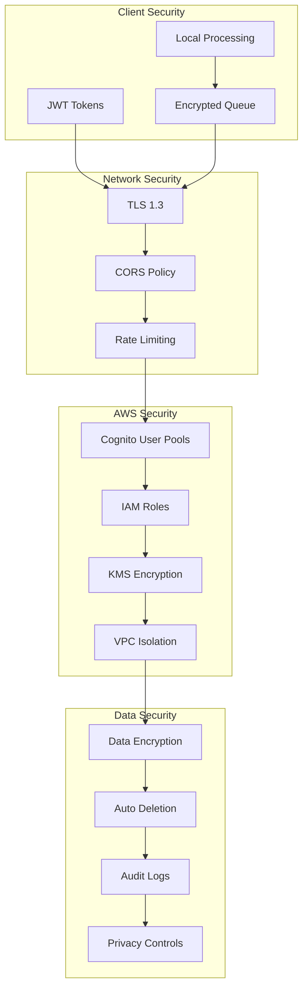
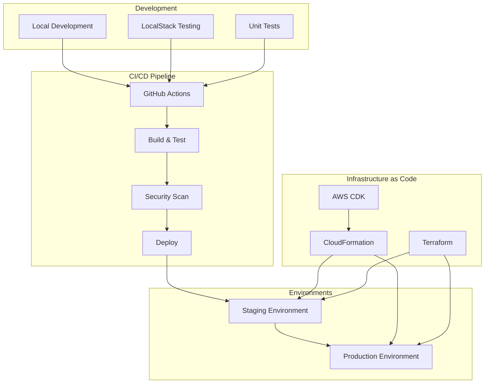

# Mindful Browse - Architecture Diagrams

## High-Level System Architecture

```mermaid
graph TB
    subgraph "User Layer"
        U[User]
        BE[Browser Extension]
        WD[Web Dashboard]
    end
    
    subgraph "AWS Cloud Infrastructure"
        subgraph "API & Load Balancing"
            ALB[Application Load Balancer]
            APIGW[API Gateway]
        end
        
        subgraph "Compute Services"
            ECS[ECS Fargate<br/>Backend API]
            LAMBDA[Lambda Functions<br/>Data Processing]
        end
        
        subgraph "AI/ML Services"
            COMP[Amazon Comprehend<br/>Sentiment Analysis]
            BEDROCK[Amazon Bedrock<br/>Advanced Insights]
        end
        
        subgraph "Data Storage"
            DDB[DynamoDB<br/>Metrics & Profiles]
            S3[S3 Encrypted<br/>Backup Storage]
        end
        
        subgraph "Security & Auth"
            COGNITO[Amazon Cognito<br/>User Management]
            KMS[AWS KMS<br/>Encryption]
            IAM[IAM Roles<br/>Access Control]
        end
        
        subgraph "Monitoring"
            CW[CloudWatch<br/>Logging & Metrics]
            XRAY[X-Ray<br/>Tracing]
        end
    end
    
    %% User interactions
    U --> BE
    U --> WD
    
    %% Browser Extension flow
    BE --> APIGW
    APIGW --> LAMBDA
    
    %% Web Dashboard flow
    WD --> ALB
    ALB --> ECS
    
    %% Data processing
    LAMBDA --> COMP
    LAMBDA --> BEDROCK
    LAMBDA --> DDB
    ECS --> DDB
    ECS --> S3
    
    %% Security
    COGNITO --> APIGW
    COGNITO --> ALB
    KMS --> S3
    IAM --> ECS
    IAM --> LAMBDA
    
    %% Monitoring
    CW --> ECS
    CW --> LAMBDA
    XRAY --> ECS
    XRAY --> LAMBDA
    
    classDef userLayer fill:#e1f5fe
    classDef apiLayer fill:#f3e5f5
    classDef computeLayer fill:#e8f5e8
    classDef aiLayer fill:#fff3e0
    classDef storageLayer fill:#fce4ec
    classDef securityLayer fill:#ffebee
    classDef monitoringLayer fill:#f1f8e9
    
    class U,BE,WD userLayer
    class ALB,APIGW apiLayer
    class ECS,LAMBDA computeLayer
    class COMP,BEDROCK aiLayer
    class DDB,S3 storageLayer
    class COGNITO,KMS,IAM securityLayer
    class CW,XRAY monitoringLayer
```

## Data Flow Architecture

```mermaid
sequenceDiagram
    participant BE as Browser Extension
    participant API as API Gateway
    participant L as Lambda Functions
    participant COMP as Amazon Comprehend
    participant DDB as DynamoDB
    participant WD as Web Dashboard
    participant ECS as ECS Backend
    
    Note over BE: User browses web
    BE->>BE: Collect metadata locally
    BE->>BE: Queue browsing events
    
    Note over BE,API: Batch transmission
    BE->>API: POST /events (authenticated)
    API->>L: Trigger processing
    
    Note over L,COMP: AI Processing
    L->>COMP: Analyze sentiment
    L->>COMP: Classify topics
    COMP-->>L: Return classifications
    
    Note over L: Calculate wellbeing metrics
    L->>L: Compute 6 wellbeing scores
    L->>DDB: Store daily metrics
    
    Note over WD,ECS: Dashboard access
    WD->>ECS: GET /dashboard (authenticated)
    ECS->>DDB: Query user metrics
    DDB-->>ECS: Return aggregated data
    ECS-->>WD: Dashboard data
    WD->>WD: Render visualizations
```

## Component Architecture

```mermaid
graph LR
    subgraph "Browser Extension"
        CS[Content Script]
        BG[Background Worker]
        POP[Popup UI]
        IDB[IndexedDB Queue]
    end
    
    subgraph "Backend Services"
        AUTH[Auth Service]
        PROC[Processing Service]
        DASH[Dashboard Service]
        EXPORT[Export Service]
    end
    
    subgraph "Data Processing Pipeline"
        SENT[Sentiment Analysis]
        TOPIC[Topic Classification]
        METRICS[Metrics Calculator]
        INSIGHTS[Insight Generator]
    end
    
    subgraph "Data Layer"
        USER[User Profiles]
        DAILY[Daily Metrics]
        BACKUP[Encrypted Backups]
    end
    
    CS --> BG
    BG --> IDB
    IDB --> AUTH
    
    AUTH --> PROC
    PROC --> SENT
    PROC --> TOPIC
    SENT --> METRICS
    TOPIC --> METRICS
    METRICS --> DAILY
    
    DASH --> USER
    DASH --> DAILY
    INSIGHTS --> DAILY
    
    EXPORT --> USER
    EXPORT --> DAILY
    EXPORT --> BACKUP
    
    POP --> DASH
```

## Security Architecture

```mermaid
graph TB
    subgraph "Client Security"
        JWT[JWT Tokens]
        LOCAL[Local Processing]
        QUEUE[Encrypted Queue]
    end
    
    subgraph "Network Security"
        TLS[TLS 1.3]
        CORS[CORS Policy]
        RATE[Rate Limiting]
    end
    
    subgraph "AWS Security"
        COGNITO[Cognito User Pools]
        IAM[IAM Roles]
        KMS[KMS Encryption]
        VPC[VPC Isolation]
    end
    
    subgraph "Data Security"
        ENCRYPT[Data Encryption]
        TTL[Auto Deletion]
        AUDIT[Audit Logs]
        PRIVACY[Privacy Controls]
    end
    
    JWT --> TLS
    LOCAL --> QUEUE
    QUEUE --> TLS
    
    TLS --> CORS
    CORS --> RATE
    RATE --> COGNITO
    
    COGNITO --> IAM
    IAM --> KMS
    KMS --> VPC
    
    VPC --> ENCRYPT
    ENCRYPT --> TTL
    TTL --> AUDIT
    AUDIT --> PRIVACY
```

## Deployment Architecture

```mermaid
graph TB
    subgraph "Development"
        DEV[Local Development]
        LOCALSTACK[LocalStack Testing]
        UNIT[Unit Tests]
    end
    
    subgraph "CI/CD Pipeline"
        GH[GitHub Actions]
        BUILD[Build & Test]
        SECURITY[Security Scan]
        DEPLOY[Deploy]
    end
    
    subgraph "Environments"
        STAGING[Staging Environment]
        PROD[Production Environment]
    end
    
    subgraph "Infrastructure as Code"
        CDK[AWS CDK]
        CF[CloudFormation]
        TERRAFORM[Terraform]
    end
    
    DEV --> GH
    LOCALSTACK --> GH
    UNIT --> GH
    
    GH --> BUILD
    BUILD --> SECURITY
    SECURITY --> DEPLOY
    
    DEPLOY --> STAGING
    STAGING --> PROD
    
    CDK --> CF
    CF --> STAGING
    CF --> PROD
    TERRAFORM --> STAGING
    TERRAFORM --> PROD
```