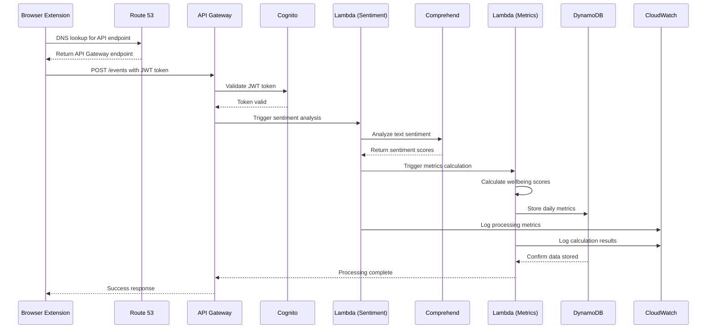

# Mindful Browse - AWS Services Architecture

## Complete AWS Architecture Diagram

```mermaid
graph TB
    subgraph "Client Layer"
        BE[Browser Extension<br/>JavaScript/TypeScript]
        WD[Web Dashboard<br/>React App]
        USER[End Users]
    end
    
    subgraph "AWS Cloud Infrastructure"
        subgraph "Edge & CDN"
            CF[CloudFront CDN<br/>Global Distribution]
            R53[Route 53<br/>DNS Management]
        end
        
        subgraph "API Gateway & Load Balancing"
            APIGW[API Gateway<br/>REST APIs<br/>Rate Limiting<br/>Request Validation]
            ALB[Application Load Balancer<br/>High Availability<br/>SSL Termination]
        end
        
        subgraph "Compute Services"
            subgraph "ECS Cluster"
                ECS[ECS Fargate<br/>Backend API Service<br/>Auto Scaling]
                TASK1[Task: API Server]
                TASK2[Task: Data Processor]
            end
            
            subgraph "Lambda Functions"
                L1[Lambda: Sentiment Analysis<br/>Python Runtime<br/>Amazon Comprehend Integration]
                L2[Lambda: Topic Classification<br/>Python Runtime<br/>Content Categorization]
                L3[Lambda: Metrics Calculator<br/>Node.js Runtime<br/>Wellbeing Algorithms]
                L4[Lambda: Insight Generator<br/>Python Runtime<br/>Amazon Bedrock Integration]
                L5[Lambda: Data Cleanup<br/>Python Runtime<br/>TTL Management]
            end
        end
        
        subgraph "AI/ML Services"
            COMP[Amazon Comprehend<br/>Sentiment Analysis<br/>Topic Classification<br/>Language Detection]
            BEDROCK[Amazon Bedrock<br/>Advanced AI Insights<br/>Personalized Recommendations<br/>Natural Language Generation]
        end
        
        subgraph "Data Storage"
            subgraph "DynamoDB"
                DDB[DynamoDB Table<br/>mindful-browse-data]
                DDB_USER[Partition: USER#userId<br/>Sort: PROFILE]
                DDB_METRICS[Partition: USER#userId<br/>Sort: METRICS#date]
                DDB_INSIGHTS[Partition: USER#userId<br/>Sort: INSIGHTS#date]
            end
            
            subgraph "S3 Storage"
                S3[S3 Bucket<br/>mindful-browse-backups<br/>Encrypted Storage<br/>Versioning Enabled]
                S3_USER[User Data Backups<br/>JSON Format<br/>KMS Encrypted]
                S3_STATIC[Static Web Assets<br/>Dashboard Files]
            end
        end
        
        subgraph "Security & Identity"
            COGNITO[Amazon Cognito<br/>User Pools<br/>Identity Pools<br/>JWT Token Management]
            KMS[AWS KMS<br/>Customer Managed Keys<br/>Data Encryption<br/>Key Rotation]
            IAM[AWS IAM<br/>Service Roles<br/>Policies<br/>Cross-Service Access]
            SECRETS[AWS Secrets Manager<br/>API Keys<br/>Database Credentials<br/>Configuration]
        end
        
        subgraph "Monitoring & Operations"
            CW[CloudWatch<br/>Logs & Metrics<br/>Custom Dashboards<br/>Alarms]
            XRAY[AWS X-Ray<br/>Distributed Tracing<br/>Performance Analysis]
            CONFIG[AWS Config<br/>Compliance Monitoring<br/>Resource Tracking]
            CT[CloudTrail<br/>API Audit Logs<br/>Security Monitoring]
        end
        
        subgraph "Event Processing"
            EB[EventBridge<br/>Event Routing<br/>Scheduled Tasks<br/>Cross-Service Events]
            SQS[SQS Queues<br/>Dead Letter Queues<br/>Message Processing<br/>Retry Logic]
        end
        
        subgraph "Networking"
            VPC[VPC<br/>Private Subnets<br/>Security Groups<br/>NACLs]
            NAT[NAT Gateway<br/>Outbound Internet Access]
            IGW[Internet Gateway<br/>Public Access]
        end
    end
    
    %% Client connections
    USER --> BE
    USER --> WD
    
    %% Edge layer
    WD --> CF
    CF --> ALB
    BE --> R53
    R53 --> APIGW
    
    %% API layer
    APIGW --> L1
    APIGW --> L2
    APIGW --> L3
    ALB --> ECS
    
    %% Compute relationships
    ECS --> TASK1
    ECS --> TASK2
    TASK1 --> DDB
    TASK1 --> S3
    TASK2 --> L4
    
    %% Lambda integrations
    L1 --> COMP
    L2 --> COMP
    L4 --> BEDROCK
    L3 --> DDB
    L4 --> DDB
    L5 --> DDB
    
    %% Data storage relationships
    DDB --> DDB_USER
    DDB --> DDB_METRICS
    DDB --> DDB_INSIGHTS
    S3 --> S3_USER
    S3 --> S3_STATIC
    
    %% Security integrations
    COGNITO --> APIGW
    COGNITO --> ALB
    KMS --> S3
    KMS --> DDB
    IAM --> ECS
    IAM --> L1
    IAM --> L2
    IAM --> L3
    IAM --> L4
    IAM --> L5
    SECRETS --> ECS
    SECRETS --> L1
    SECRETS --> L2
    SECRETS --> L3
    SECRETS --> L4
    
    %% Monitoring
    CW --> ECS
    CW --> L1
    CW --> L2
    CW --> L3
    CW --> L4
    CW --> L5
    XRAY --> ECS
    XRAY --> L1
    XRAY --> L2
    XRAY --> L3
    XRAY --> L4
    CONFIG --> DDB
    CONFIG --> S3
    CT --> COGNITO
    CT --> IAM
    
    %% Event processing
    EB --> L5
    EB --> L4
    SQS --> L1
    SQS --> L2
    SQS --> L3
    
    %% Networking
    ECS --> VPC
    L1 --> VPC
    L2 --> VPC
    L3 --> VPC
    L4 --> VPC
    L5 --> VPC
    VPC --> NAT
    VPC --> IGW
    
    classDef clientLayer fill:#e3f2fd
    classDef edgeLayer fill:#f3e5f5
    classDef apiLayer fill:#e8f5e8
    classDef computeLayer fill:#fff3e0
    classDef aiLayer fill:#fce4ec
    classDef storageLayer fill:#f1f8e9
    classDef securityLayer fill:#ffebee
    classDef monitoringLayer fill:#e0f2f1
    classDef eventLayer fill:#fafafa
    classDef networkLayer fill:#e8eaf6
    
    class BE,WD,USER clientLayer
    class CF,R53 edgeLayer
    class APIGW,ALB apiLayer
    class ECS,TASK1,TASK2,L1,L2,L3,L4,L5 computeLayer
    class COMP,BEDROCK aiLayer
    class DDB,DDB_USER,DDB_METRICS,DDB_INSIGHTS,S3,S3_USER,S3_STATIC storageLayer
    class COGNITO,KMS,IAM,SECRETS securityLayer
    class CW,XRAY,CONFIG,CT monitoringLayer
    class EB,SQS eventLayer
    class VPC,NAT,IGW networkLayer
```

## AWS Services Breakdown by Category

### Compute Services
- **Amazon ECS Fargate**: Serverless container platform for backend API
- **AWS Lambda**: Event-driven functions for data processing
  - Sentiment Analysis (Python)
  - Topic Classification (Python) 
  - Metrics Calculator (Node.js)
  - Insight Generator (Python)
  - Data Cleanup (Python)

### AI/ML Services
- **Amazon Comprehend**: Natural language processing
  - Real-time sentiment analysis
  - Topic classification
  - Language detection
- **Amazon Bedrock**: Generative AI platform
  - Advanced insight generation
  - Personalized recommendations
  - Natural language explanations

### Storage Services
- **Amazon DynamoDB**: NoSQL database
  - User profiles and preferences
  - Daily wellbeing metrics
  - Generated insights
  - TTL for automatic cleanup
- **Amazon S3**: Object storage
  - Encrypted user data backups
  - Static web assets for dashboard
  - Versioning and lifecycle policies

### Security & Identity
- **Amazon Cognito**: User authentication
  - User Pools for sign-up/sign-in
  - Identity Pools for AWS access
  - JWT token management
- **AWS KMS**: Key management
  - Customer-managed encryption keys
  - Automatic key rotation
  - Cross-service encryption
- **AWS IAM**: Access control
  - Service-to-service roles
  - Least privilege policies
  - Cross-account access
- **AWS Secrets Manager**: Secure configuration
  - API keys and credentials
  - Automatic rotation
  - Fine-grained access control

### API & Networking
- **Amazon API Gateway**: REST API management
  - Request validation
  - Rate limiting and throttling
  - CORS configuration
  - API key management
- **Application Load Balancer**: High availability
  - SSL/TLS termination
  - Health checks
  - Auto scaling integration
- **Amazon CloudFront**: Content delivery
  - Global edge locations
  - Static asset caching
  - SSL certificate management
- **Amazon Route 53**: DNS management
  - Domain routing
  - Health checks
  - Failover configuration

### Monitoring & Operations
- **Amazon CloudWatch**: Observability
  - Application logs
  - Custom metrics
  - Dashboards and alarms
  - Log aggregation
- **AWS X-Ray**: Distributed tracing
  - Request flow analysis
  - Performance bottlenecks
  - Error tracking
- **AWS Config**: Compliance monitoring
  - Resource configuration tracking
  - Compliance rules
  - Change notifications
- **AWS CloudTrail**: Audit logging
  - API call tracking
  - Security event monitoring
  - Compliance reporting

### Event Processing
- **Amazon EventBridge**: Event routing
  - Scheduled data cleanup
  - Cross-service communication
  - Event-driven architecture
- **Amazon SQS**: Message queuing
  - Asynchronous processing
  - Dead letter queues
  - Retry mechanisms

### Networking
- **Amazon VPC**: Virtual private cloud
  - Private subnets for compute
  - Security groups
  - Network ACLs
- **NAT Gateway**: Outbound internet access
- **Internet Gateway**: Public internet access

## Data Flow Through AWS Services

## Cost Optimization Strategy

### Compute Optimization
- **ECS Fargate**: Right-sized containers with auto-scaling
- **Lambda**: Pay-per-execution with optimized memory allocation
- **Reserved Capacity**: For predictable workloads

### Storage Optimization
- **DynamoDB**: On-demand billing with TTL for automatic cleanup
- **S3**: Intelligent tiering and lifecycle policies
- **CloudWatch Logs**: Log retention policies

### AI/ML Optimization
- **Comprehend**: Batch processing to reduce API calls
- **Bedrock**: Efficient prompt engineering and caching

### Monitoring Optimization
- **CloudWatch**: Custom metrics with appropriate retention
- **X-Ray**: Sampling rules to reduce tracing costs

This AWS architecture provides a scalable, secure, and cost-effective foundation for the Mindful Browse digital wellbeing platform, leveraging managed services to minimize operational overhead while ensuring high availability and performance.