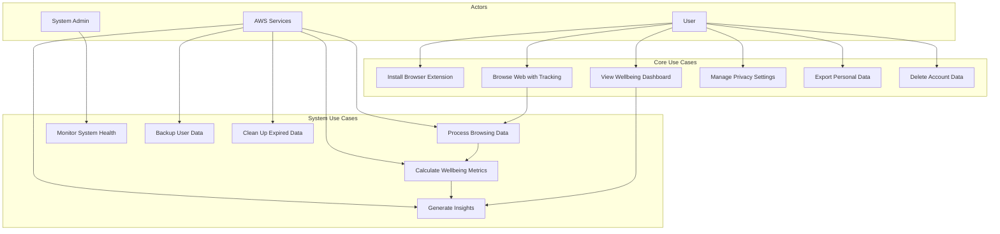
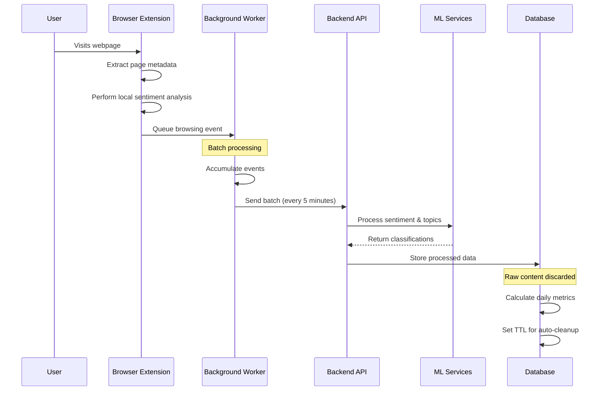
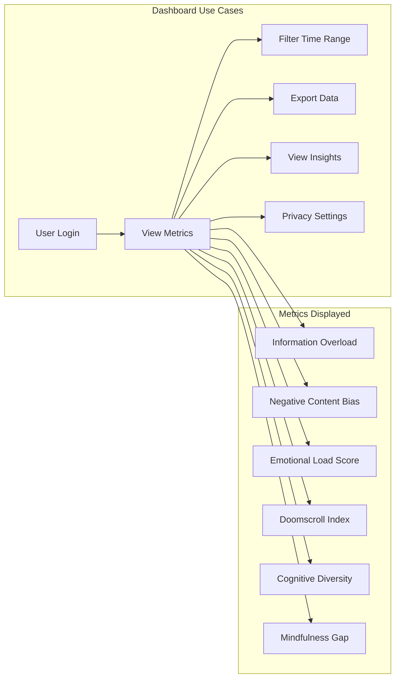
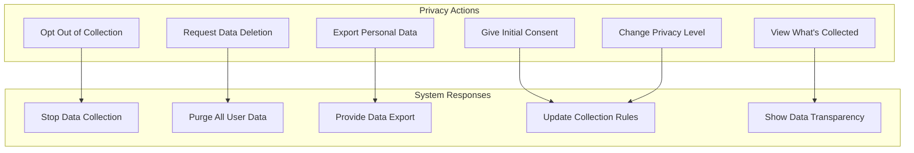
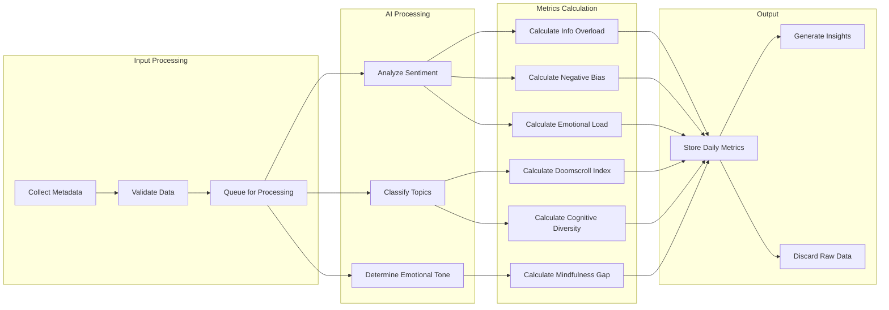
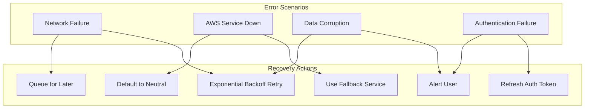
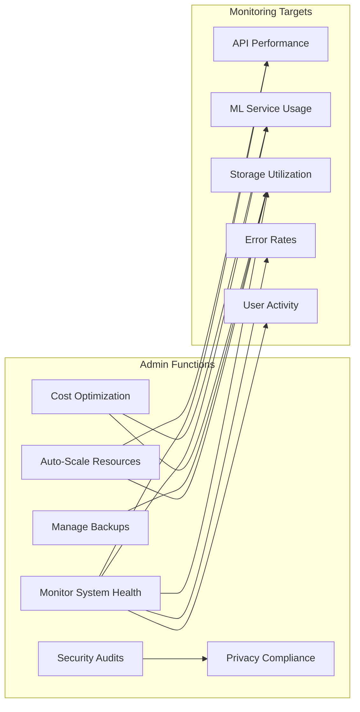

# Mindful Browse - Use Case Diagrams

## Primary Use Cases

## Detailed Use Case: Browse Web with Tracking

## Use Case: View Wellbeing Dashboard

## Privacy Control Use Cases

## Data Processing Use Cases

## Error Handling Use Cases

## System Administration Use Cases

